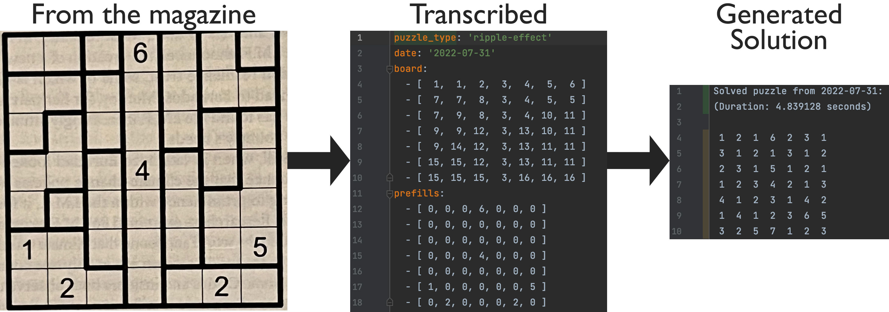
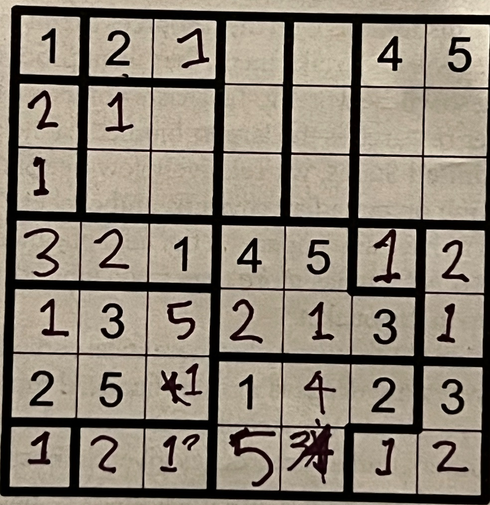

# Puzzle Helper
This isn't for the crosswords. It's for the little puzzles in the upper right of the previous page. They change every
quarter or so. This library will only help solve some of them.


## Supported Puzzles
* Criss Cross Sudoku (Active September 2023)
* All Or One (Active May 2023)
* Ripple Effect (Active July 2022)
* SkyScrapers (Active around 2016 - partial support)
* Two Not touch (Active in daily paper 2023/24 -- Board static image generation only)

## Usage
1. Clone this repo and install dependencies
   ```
   $ git clone git@github.com:balsama/ntypuzzlehelper.git && cd ntypuzzlehelper && composer install
   ```
2. Define a board
   ```injectablephp
   $board = [
        [1, 2, 2, 3, 4, 4, 5],
        [2, 2, 2, 3, 4, 4, 4],
        [2, 2, 6, 3, 3, 4, 4],
        [6, 6, 6, 7, 8, 8, 8],
        [9, 9, 10, 10, 8, 11, 11],
        [9, 9, 9, 10, 11, 11, 11],
        [12, 9, 9, 10, 11, 11, 13],
    ];
   ```
3. Define the known values for the board
   ```injectablephp
    $boardPrefills = [
        [0, 0, 5, 0, 0, 0, 0],
        [0, 7, 0, 2, 0, 3, 0],
        [0, 0, 1, 0, 4, 0, 5],
        [0, 4, 0, 0, 0, 1, 0],
        [6, 0, 2, 0, 3, 0, 0],
        [0, 3, 0, 1, 0, 7, 0],
        [0, 0, 0, 0, 5, 0, 0],
    ];
   ```
4. Define any shaded regions (in, for example Light and Shadow Boards).
   ```injectablephp
    $boardShadows = [
        [0, 0, 1, 0, 0, 0, 0],
        [0, 1, 0, 0, 0, 3, 0],
        [0, 0, 1, 0, 1, 0, 0],
        [0, 1, 0, 0, 0, 1, 0],
        [1, 0, 0, 0, 0, 0, 0],
        [0, 1, 0, 1, 0, 0, 0],
        [0, 0, 0, 0, 0, 0, 0],
    ];
   ```

5. Instantiate the board
   ```injectablephp
   $board = new \Balsama\Nytpuzzlehelper\RippleEffect\RippleEffectBoard(
       $board,
       $boardPrefills,
       $boardShadows,
       [
           'puzzle_type' => 'Ripple Effect',
           'date' => '2024-01-07'
       ]
   );
   ```
6. Solve
   ```injectablephp
   $board->solve();
   ```
7. Get results
    ```injectablephp
   $board->getPrettySolution();
    ```
## Creating static images of Boards
The PuzzleBoardStaticImageGenerator class can generate a static PNG from any Board class.

```injectablephp
$board = new \Balsama\Nytpuzzlehelper\Board(
    $board,
    $boardPrefills,
    $boardShadows,
    [
        'puzzle_type' => 'Ripple Effect',
        'date' => '2024-01-07'
    ]
);
$puzzleBoardStaticImageGenerator = new PuzzleBoardStaticImageGenerator($board);

// Save a single image.
$puzzleBoardStaticImageGenerator->saveRaster($puzzle['puzzle_type'] . '--' . $puzzle['date'] . '.png');
// Save a 2x3 grid of images.
$puzzleBoardStaticImageGenerator->save2x3Grid($puzzle['puzzle_type'] . '--' . $puzzle['date'] . '--page.png');
```

## Why N*T*Y Puzzle Helper? (Instead of NYT)
Because I made a typo when creating the repo.

## Why?
They were too hard to solve manually on my own and it was fun to try and formalize the logic.
